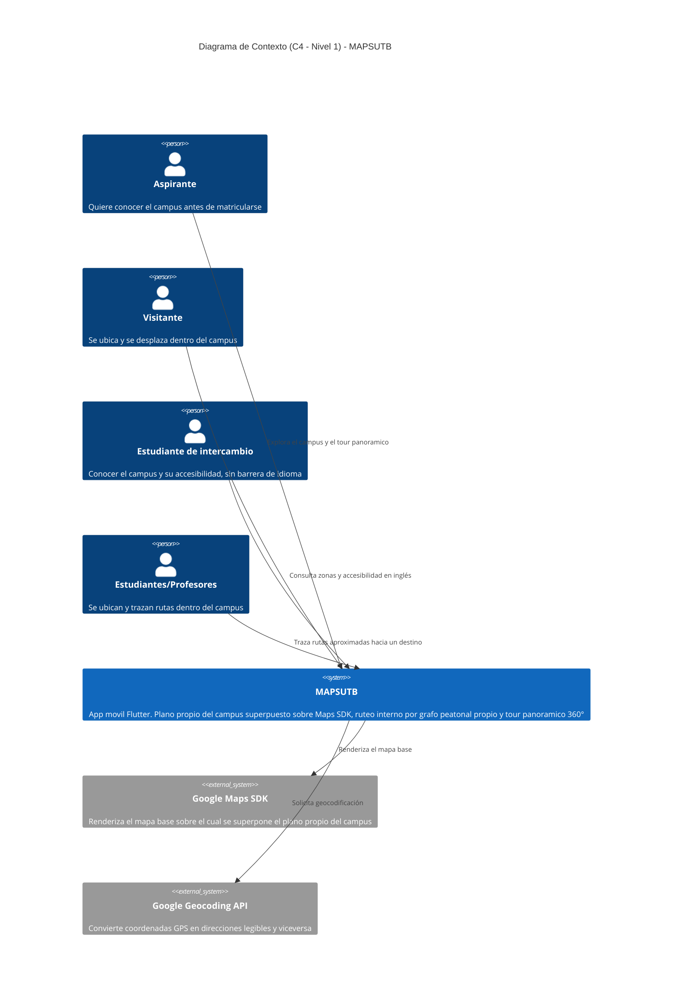

```mermaid
---
config:
  fontFamily: '''Inter Variable'', sans-serif'
---
C4Context
    title Diagrama de Contexto (C4 - Nivel 1) - MAPSUTB

    Person(aspirante, "Aspirante", "Quiere conocer el campus antes de matricularse")
    Person(invitado, "Visitante", "Se ubica y se desplaza dentro del campus")
    Person(intercambio, "Estudiante de intercambio", "Conocer el campus y su accesibilidad, sin barrera de idioma")
    Person(comunidad, "Estudiantes/Profesores", "Se ubican y trazan rutas dentro del campus")

    System(mapsutb, "MAPSUTB", "App movil Flutter. Plano propio del campus superpuesto sobre Maps SDK, ruteo interno por grafo peatonal propio y tour panoramico 360°")

    System_Ext(mapssdk, "Google Maps SDK", "Renderiza el mapa base sobre el cual se superpone el plano propio del campus")
    System_Ext(geocoding, "Google Geocoding API", "Convierte coordenadas GPS en direcciones legibles y viceversa")

    Rel_L(aspirante, mapsutb, "Explora el campus y el tour panoramico")
    Rel(invitado, mapsutb,"")
    Rel(intercambio, mapsutb, "Consulta zonas y accesibilidad en inglés")
    Rel(comunidad, mapsutb, "Traza rutas aproximadas hacia un destino")
    Rel_D(mapsutb, geocoding, "Solicita geocodificación")
    Rel_D(mapsutb, mapssdk, "Renderiza el mapa base")

    UpdateLayoutConfig($c4ShapeInRow="3", $c4BoundaryInRow="1")
```
