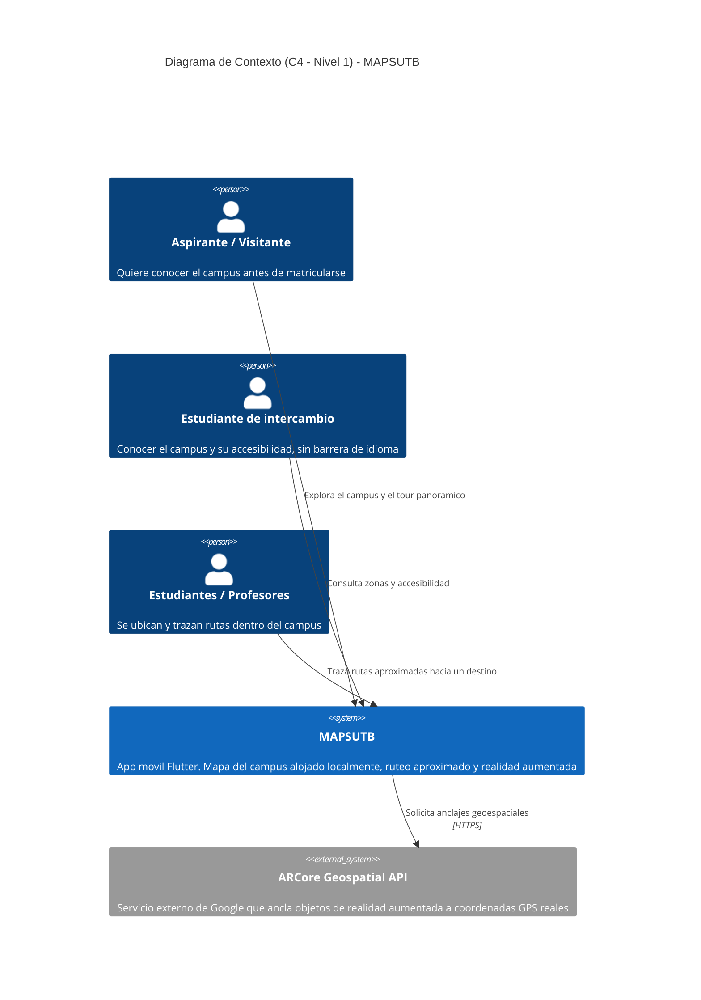

```mermaid
C4Context
    title Diagrama de Contexto (C4 - Nivel 1) - MAPSUTB

    Person(aspirante, "Aspirante / Visitante", "Quiere conocer el campus antes de matricularse")
    Person(intercambio, "Estudiante de intercambio", "Conocer el campus y su accesibilidad, sin barrera de idioma")
    Person(comunidad, "Estudiantes / Profesores", "Se ubican y trazan rutas dentro del campus")

    System(mapsutb, "MAPSUTB", "App movil Flutter. Mapa del campus alojado localmente, ruteo aproximado y realidad aumentada")

    System_Ext(arcore, "ARCore Geospatial API", "Servicio externo de Google que ancla objetos de realidad aumentada a coordenadas GPS reales")

    Rel(aspirante, mapsutb, "Explora el campus y el tour panoramico")
    Rel(intercambio, mapsutb, "Consulta zonas y accesibilidad")
    Rel(comunidad, mapsutb, "Traza rutas aproximadas hacia un destino")
    Rel(mapsutb, arcore, "Solicita anclajes geoespaciales", "HTTPS")

    UpdateLayoutConfig($c4ShapeInRow="3", $c4BoundaryInRow="1")
```
