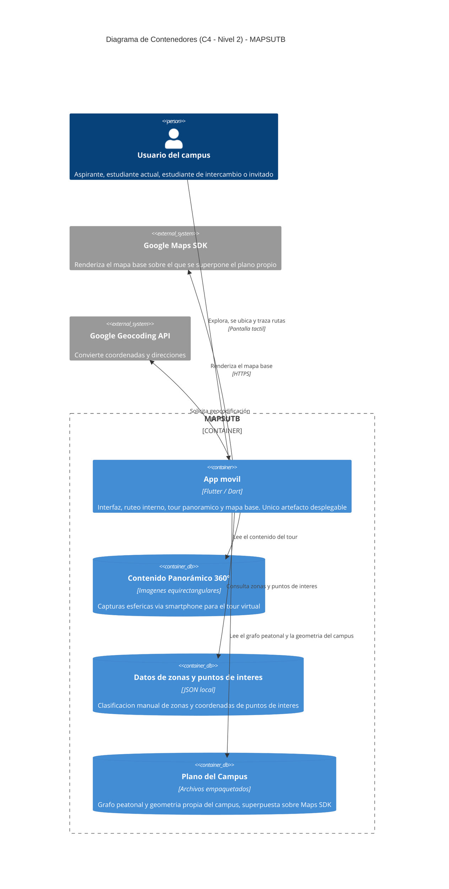

```mermaid
---
config:
  fontFamily: '''Inter Variable'', sans-serif'
---
C4Container
    title Diagrama de Contenedores (C4 - Nivel 2) - MAPSUTB

    Person(usuario, "Usuario del campus", "Aspirante, estudiante actual, estudiante de intercambio o invitado")

    Container_Boundary(mapsutb, "MAPSUTB") {
        Container(app, "App movil", "Flutter / Dart", "Interfaz, ruteo interno, tour panoramico y mapa base. Unico artefacto desplegable")
        ContainerDb(assets, "Contenido Panorámico 360°", "Imagenes equirectangulares", "Capturas esfericas via smartphone para el tour virtual")
        ContainerDb(datos, "Datos de zonas y puntos de interes", "JSON local", "Clasificacion manual de zonas y coordenadas de puntos de interes")
        ContainerDb(plano, "Plano del Campus", "Archivos empaquetados", "Grafo peatonal y geometria propia del campus, superpuesta sobre Maps SDK")
    }

    System_Ext(mapssdk, "Google Maps SDK", "Renderiza el mapa base sobre el que se superpone el plano propio")
    System_Ext(geocoding, "Google Geocoding API", "Convierte coordenadas y direcciones")

    Rel(usuario, app, "Explora, se ubica y traza rutas", "Pantalla tactil")
    Rel(app, assets, "Lee el contenido del tour")
    Rel(app, datos, "Consulta zonas y puntos de interes")
    Rel(app, plano, "Lee el grafo peatonal y la geometria del campus")
    Rel(app, mapssdk, "Renderiza el mapa base", "HTTPS")
    Rel(app, geocoding, "Solicita geocodificación", "HTTPS")


    UpdateLayoutConfig($c4ShapeInRow="2", $c4BoundaryInRow="1")

```
