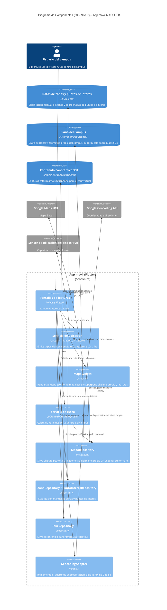

```mermaid
---
config:
  fontFamily: '''Inter Variable'', sans-serif'
---
C4Component
    title Diagrama de Componentes (C4 - Nivel 3) - App movil MAPSUTB

    Person(usuario, "Usuario del campus", "Explora, se ubica y traza rutas dentro del campus")

    Container_Boundary(app, "App movil (Flutter)") {
        Component(ui, "Pantallas de features", "Widgets Flutter", "tour, mapas_ruteo, zonas")
        Component(ubicacion, "Servicio de ubicacion", "Observer - Stream<Ubicacion>", "Emite la posicion en tiempo real a quien se suscriba")
        Component(widget, "MapaWidget", "Adapter", "Renderiza Maps SDK como mapa base y superpone el plano propio y las rutas")
        Component(ruteo, "Servicio de ruteo", "Dijkstra sobre grafo propio", "Calcula la ruta mas corta dentro del campus")
        Component(mapaRepo, "MapaRepository", "Repository", "Sirve el grafo peatonal y la geometria del plano propio sin exponer su formato")
        Component(zonaRepo, "ZonaRepository / PuntoInteresRepository", "Repository", "Clasificacion manual de zonas y puntos de interes")
        Component(tourRepo, "TourRepository", "Repository", "Sirve el contenido panoramico 360° del tour")
        Component(geocodingAdap, "GeocodingAdapter", "Adapter", "Implementa el puerto de geocodificacion; aisla la API de Google")

    }

    ContainerDb(datos, "Datos de zonas y puntos de interes", "JSON local", "Clasificacion manual de zonas y coordenadas de puntos de interes")
    ContainerDb(plano, "Plano del Campus", "Archivos empaquetados", "Grafo peatonal y geometria propia del campus, superpuesta sobre Maps SDK")
    ContainerDb(assets, "Contenido Panorámico 360°", "Imagenes equirectangulares", "Capturas esfericas via smartphone para el tour virtual")
    System_Ext(mapssdk, "Google Maps SDK", "Mapa Base")
    System_Ext(geocoding, "Google Geocoding API", "Coordenadas y direcciones")
    System_Ext(sensor, "Sensor de ubicacion del dispositivo", "Capacidad de la plataforma")

    Rel(usuario, ui, "Interactua")

    Rel(ui, ubicacion, "Se suscribe al stream")
    Rel(ui, ruteo, "Solicita una ruta dentro del campus")
    Rel(ui, zonaRepo, "Consulta zonas y puntos de interes")
    Rel(ui, widget, "Muestra el mapa base con capas propias")
    Rel(ui, geocodingAdap, "Solicita geocodificacion")
    Rel(ui, tourRepo, "Solicita panoramicas del tour")

    Rel(ubicacion, sensor, "Escucha cambios de posicion")

    Rel(ruteo, mapaRepo, "Lee el grafo peatonal")
    Rel(widget, mapaRepo, "Lee la geometria del plano propio")
    Rel(widget, mapssdk, "Renderiza el mapa base", "HTTPS")
    Rel(geocodingAdap, geocoding, "Solicita geocodificacion", "HTTPS")

    Rel(mapaRepo, plano, "Lee")
    Rel(zonaRepo, datos, "Lee")
    Rel(tourRepo, assets, "Lee")

    UpdateLayoutConfig($c4ShapeInRow="3", $c4BoundaryInRow="1")
```
