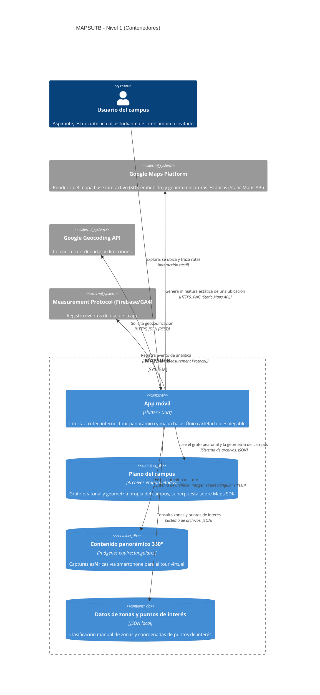

## Vista de Bloques

**Motivación:**

MAPSUTB se separa en un único artefacto desplegable (la app móvil Flutter) y tres almacenes de datos empaquetados
localmente (plano del campus, contenido panorámico y datos de zonas/puntos de interés). No existe backend propio:
toda la información vive dentro del paquete de la app o se resuelve consultando directamente los servicios de Google
(Maps Platform, Geocoding API) y de Measurement Protocol para analítica de uso, lo que reduce la infraestructura a
cargo del equipo pero introduce una dependencia fuerte de la disponibilidad de estos servicios externos (ver
[decisiones de diseño](#section-design-decisions) y restricciones técnicas).

**Bloques de construcción contenidos:**

| **Nombre** | **Responsabilidad** |
|---|---|
| App móvil | Único artefacto desplegable. Contiene toda la lógica de interfaz, ubicación, ruteo interno, mapa base y tour panorámico. |
| Plano del campus | Empaqueta el grafo peatonal y la geometría propia del campus, usados para el ruteo interno y para superponerse sobre Maps SDK. |
| Contenido panorámico 360° | Empaqueta las imágenes equirectangulares capturadas vía smartphone para el módulo de tour virtual. |
| Datos de zonas y puntos de interés | Empaqueta el JSON con la clasificación manual de zonas (salones, laboratorios, oficinas) y sus coordenadas. |

**Interfases importantes:**

- **Google Maps Platform** — SDK embebido (nativo) para el mapa base interactivo, y HTTPS/PNG (Static Maps API) para
  miniaturas estáticas de una ubicación. Solo la segunda tiene contrato ejecutable (ver más abajo); la primera no
  expone una llamada REST que el código propio de MAPSUTB construya.
- **Google Geocoding API** (HTTPS, JSON/REST — contrato en [`docs/api/apis-externas.openapi.yaml`](../api/apis-externas.openapi.yaml)): usada por la App móvil para convertir coordenadas GPS en direcciones legibles y viceversa. Integración síncrona request/response (ver [ADR 0005](../adr/0005-integracion-apis-externas.md)).
- **Measurement Protocol (Firebase/GA4)** (HTTPS, JSON — mismo contrato): usado por la App móvil para registrar eventos de uso (consulta de zonas, solicitud de rutas, tour 360°) sin agregar el SDK nativo de Firebase (ver [ADR 0005](../adr/0005-integracion-apis-externas.md)).

#### App móvil

_Propósito/Responsabilidad_

Único artefacto desplegable del sistema. Provee la interfaz de usuario (pantallas de tour, mapas/ruteo y zonas),
gestiona la ubicación en tiempo real del usuario, calcula rutas dentro del campus sobre el grafo peatonal propio,
renderiza el mapa base (Maps SDK) con el plano propio superpuesto, muestra el tour panorámico 360° y registra
eventos de uso para analítica.

_Interfase(s)_

- Consume el sensor de ubicación del dispositivo.
- Consume Google Maps Platform: SDK embebido (nativo) para el mapa base, y Static Maps API (HTTPS, PNG) para
  miniaturas estáticas.
- Consume Google Geocoding API (HTTPS, JSON/REST, síncrona) para geocodificación.
- Consume Measurement Protocol (HTTPS, JSON, síncrona, de mejor esfuerzo) para registrar eventos de uso.
- Lee los tres contenedores de datos empaquetados localmente (plano, panoramas, datos de zonas) vía sistema de archivos, JSON o imagen equirectangular (JPEG) según el contenedor.

_Características de Calidad/Performance_

Requiere conexión a internet permanente; no funciona offline. No está restringida a la red wifi institucional ni al
perímetro del campus.

_Ubicación Archivo/Directorio_

Repositorio: `github.com/ISCOUTB/AS_202620_mapsutb`

_Requerimientos Satisfechos_

Geolocalización en tiempo real, trazado de rutas dentro del campus, clasificación de zonas, tour panorámico, interfaz
en inglés para estudiantes de intercambio.

_Riesgos/Problemas/Incidentes Abiertos_

Aún no se ha definido el motor/librería para mostrar panorámicas 360° en Flutter. La navegación en interiores queda
fuera del alcance inicial.

#### Plano del campus

_Propósito/Responsabilidad_

Almacena, empaquetado dentro de la app, el grafo peatonal (nodos y conexiones entre entradas, plazoletas y bloques)
y la geometría propia del campus, usados para el ruteo interno y para superponerse visualmente sobre el mapa base
de Maps SDK.

_Interfase(s)_

Expuesto a la App móvil a través de un repositorio (`MapaRepository`) que oculta el formato interno del archivo
(sistema de archivos, JSON).

_Riesgos/Problemas/Incidentes Abiertos_

El levantamiento del grafo peatonal es manual y depende de que el equipo lo mantenga actualizado ante cambios físicos
del campus.

#### Contenido panorámico 360°

_Propósito/Responsabilidad_

Almacena las imágenes equirectangulares (capturas esféricas vía smartphone, tipo Google Street View App) usadas por
el módulo de tour virtual.

_Interfase(s)_

Expuesto a la App móvil a través de un repositorio (`TourRepository`), sistema de archivos, imagen equirectangular (JPEG).

_Riesgos/Problemas/Incidentes Abiertos_

El equipo no cuenta con cámaras 360° dedicadas; la calidad de la captura depende del smartphone usado. Aún no se ha
definido el motor/librería de renderizado 360° en Flutter.

#### Datos de zonas y puntos de interés

_Propósito/Responsabilidad_

Almacena la clasificación manual de zonas del campus (salones, laboratorios, oficinas, etc.) y las coordenadas de
sus puntos de interés.

_Interfase(s)_

Expuesto a la App móvil a través de un repositorio (`ZonaRepository`, ver ADR 0006), sistema de
archivos, JSON.

_Riesgos/Problemas/Incidentes Abiertos_

La clasificación es cargada manualmente por el equipo; no se actualiza dinámicamente ni la mantiene la universidad.

#### Google Maps Platform

_Propósito/Responsabilidad_

Servicio externo de Google con dos usos distintos en MAPSUTB: (1) renderiza el mapa base interactivo (con
coordenadas GPS reales) sobre el cual la App móvil superpone el plano propio del campus, vía SDK nativo embebido;
(2) genera miniaturas estáticas de una ubicación (p. ej. para una tarjeta de punto de interés) vía Static Maps API.

_Interfase(s)_

- Mapa base interactivo: SDK nativo embebido (no HTTP propio de MAPSUTB).
- Miniaturas estáticas: HTTPS / REST, PNG. Contrato en [`docs/api/apis-externas.openapi.yaml`](../api/apis-externas.openapi.yaml)
  (ver [ADR 0005](../adr/0005-integracion-apis-externas.md)).

_Riesgos/Problemas/Incidentes Abiertos_

Dependencia fuerte de la disponibilidad del servicio de Google; sujeto a límites de cuota/costo según uso.

#### Google Geocoding API

_Propósito/Responsabilidad_

Servicio externo de Google que convierte coordenadas GPS en direcciones legibles y viceversa.

_Interfase(s)_

HTTPS / REST, JSON. Integración síncrona request/response (ver [ADR 0005](../adr/0005-integracion-apis-externas.md)).
Contrato consumido documentado en [`docs/api/apis-externas.openapi.yaml`](../api/apis-externas.openapi.yaml).

_Riesgos/Problemas/Incidentes Abiertos_

Dependencia fuerte de la disponibilidad del servicio de Google; sujeto a límites de cuota/costo según uso.

#### Measurement Protocol (Firebase/GA4)

_Propósito/Responsabilidad_

Endpoint público de recolección de eventos de Google Analytics/GA4 (la misma plataforma detrás de Firebase
Analytics), consumido directamente por HTTP en vez de mediante el SDK nativo de Firebase, para mantener el evento
contract-testable y no agregar una dependencia nativa al proyecto (ver [ADR 0005](../adr/0005-integracion-apis-externas.md)
para el porqué de esta elección y la consecuencia aceptada de perder los eventos automáticos del SDK).

_Interfase(s)_

HTTPS / REST, JSON. Integración síncrona, de mejor esfuerzo (un fallo de red no interrumpe el flujo principal).
Contrato en [`docs/api/apis-externas.openapi.yaml`](../api/apis-externas.openapi.yaml).

_Riesgos/Problemas/Incidentes Abiertos_

Sin los eventos automáticos del SDK de Firebase (`screen_view`, `session_start`, etc.); solo se registran los
eventos personalizados que `AnalyticsAdapter` envía explícitamente.

### Nivel 2

#### Caja Blanca App móvil

Se detalla la App móvil por ser el único artefacto desplegable del sistema y el que concentra toda la lógica de
negocio. Los demás bloques del Nivel 1 (plano del campus, contenido panorámico, datos de zonas) son simples
almacenes de datos empaquetados sin lógica propia, por lo que no se detallan en un nivel adicional.

```mermaid
C4Component
    title MAPSUTB - Nivel 2 (Componentes de la App móvil)
 
    Person(usuario, "Usuario del campus", "Explora, se ubica y traza rutas dentro del campus")
 
    Container_Boundary(app, "App móvil (Flutter)") {
        Component(ui, "Pantallas de features", "Widgets Flutter", "tour, mapas_ruteo, zonas")
        Component(ubicacion, "Servicio de ubicación", "Observer - Stream<Ubicacion>", "Emite la posición en tiempo real a quien se suscriba")
        Component(widget, "MapaWidget", "Adapter", "Renderiza Maps SDK como mapa base y superpone el plano propio y las rutas")
        Component(ruteo, "Servicio de ruteo", "Dijkstra sobre grafo propio", "Calcula la ruta más corta dentro del campus")
        Component(mapaRepo, "MapaRepository", "Repository", "Sirve el grafo peatonal y la geometría del plano propio sin exponer su formato")
        Component(zonaRepo, "ZonaRepository", "Repository", "Clasificación manual de zonas y puntos de interés (Zona y Espacio, ver ADR 0006)")
        Component(tourRepo, "TourRepository", "Repository", "Sirve el contenido panorámico 360° del tour")
        Component(geocodingAdap, "GeocodingAdapter", "Adapter", "Implementa el puerto de geocodificación; aísla la API de Google")
        Component(staticMapAdap, "StaticMapAdapter", "Adapter", "Genera miniaturas estáticas de ubicación; aísla Static Maps API")
        Component(analyticsAdap, "AnalyticsAdapter", "Adapter", "Registra eventos de uso; aísla el Measurement Protocol")
    }
 
    ContainerDb(datos, "Datos de zonas y puntos de interés", "JSON local", "Clasificación manual")
    ContainerDb(plano, "Plano del campus", "Archivos empaquetados", "Grafo peatonal y geometría propia")
    ContainerDb(panoramas, "Contenido panorámico 360°", "Imágenes equirectangulares", "Capturas esféricas propias")
    System_Ext(mapssdk, "Google Maps Platform", "Mapa base interactivo (SDK) y miniaturas estáticas (Static Maps API)")
    System_Ext(geocoding, "Google Geocoding API", "Coordenadas y direcciones")
    System_Ext(analytics, "Measurement Protocol (Firebase/GA4)", "Eventos de uso")
    System_Ext(sensor, "Sensor de ubicación del dispositivo", "Capacidad de la plataforma")
 
    Rel(usuario, ui, "Interactúa", "Interacción táctil")
 
    Rel(ui, ubicacion, "Se suscribe al stream", "Llamada a método (in-process), Stream<Ubicacion>")
    Rel(ui, ruteo, "Solicita una ruta dentro del campus", "Llamada a método (in-process)")
    Rel(ui, zonaRepo, "Consulta zonas y puntos de interés", "Llamada a método (in-process)")
    Rel(ui, widget, "Muestra el mapa base con capas propias", "Composición de widgets (in-process)")
    Rel(ui, geocodingAdap, "Solicita geocodificación", "Llamada a método (in-process), async/await")
    Rel(ui, staticMapAdap, "Solicita miniatura de una ubicación", "Llamada a método (in-process), async/await")
    Rel(ui, analyticsAdap, "Registra un evento de uso", "Llamada a método (in-process), async/await, de mejor esfuerzo")
    Rel(ui, tourRepo, "Solicita panorámicas del tour", "Llamada a método (in-process)")
 
    Rel(ubicacion, sensor, "Escucha cambios de posición", "API de plataforma (in-process), coordenadas (double)")
 
    Rel(ruteo, mapaRepo, "Lee el grafo peatonal", "Llamada a método (in-process)")
    Rel(widget, mapaRepo, "Lee la geometría del plano propio", "Llamada a método (in-process)")
    Rel(widget, mapssdk, "Renderiza el mapa base", "SDK embebido (nativo), tiles/vectores")
    Rel(geocodingAdap, geocoding, "Solicita geocodificación", "HTTPS, JSON (REST)")
    Rel(staticMapAdap, mapssdk, "Solicita miniatura estática", "HTTPS, PNG (Static Maps API)")
    Rel(analyticsAdap, analytics, "Envía evento de uso", "HTTPS, JSON (Measurement Protocol)")
 
    Rel(mapaRepo, plano, "Lee", "Sistema de archivos, JSON")
    Rel(zonaRepo, datos, "Lee", "Sistema de archivos, JSON")
    Rel(tourRepo, panoramas, "Lee", "Sistema de archivos, imagen equirectangular (JPEG)")
```

- **Pantallas de features** (Widgets Flutter): agrupa las pantallas de tour, mapas/ruteo y zonas; es el único punto de
  entrada de la interacción del usuario.
- **Servicio de ubicación** (patrón Observer, `Stream<Ubicacion>`): escucha el sensor de ubicación del dispositivo y
  emite la posición en tiempo real a quien se suscriba.
- **MapaWidget** (patrón Adapter): renderiza Google Maps SDK como mapa base y superpone sobre él el plano propio del
  campus y las rutas calculadas.
- **Servicio de ruteo** (Dijkstra sobre grafo propio): calcula la ruta más corta dentro del campus a partir del grafo
  peatonal; no depende de ningún servicio externo.
- **MapaRepository** (patrón Repository): sirve el grafo peatonal y la geometría del plano propio sin exponer su
  formato de archivo.
- **ZonaRepository** (patrón Repository): sirve la clasificación manual de zonas y espacios/puntos de
  interés desde el JSON local.
- **TourRepository** (patrón Repository): sirve el contenido panorámico 360° al módulo de tour.
- **GeocodingAdapter** (patrón Adapter): implementa el puerto de geocodificación y aísla al resto de la app del SDK de
  Google Geocoding. Integración síncrona request/response sobre HTTPS (ver [ADR 0005](../adr/0005-integracion-apis-externas.md));
  contrato consumido en [`docs/api/apis-externas.openapi.yaml`](../api/apis-externas.openapi.yaml), validado en
  [`test/geocoding_adapter_contract_test.dart`](../../test/geocoding_adapter_contract_test.dart).
- **StaticMapAdapter** (patrón Adapter): implementa el puerto de miniaturas de mapa y aísla al resto de la app de
  Google Static Maps API. Contrato en [`docs/api/apis-externas.openapi.yaml`](../api/apis-externas.openapi.yaml),
  validado en [`test/static_map_adapter_contract_test.dart`](../../test/static_map_adapter_contract_test.dart).
- **AnalyticsAdapter** (patrón Adapter): implementa el puerto de analítica de uso y aísla al resto de la app del
  Measurement Protocol; falla de forma silenciosa ante errores de red (de mejor esfuerzo). Contrato en
  [`docs/api/apis-externas.openapi.yaml`](../api/apis-externas.openapi.yaml), validado en
  [`test/analytics_adapter_contract_test.dart`](../../test/analytics_adapter_contract_test.dart).

### Nivel 3

No se documenta un Nivel 3. Los componentes descritos en el Nivel 2 (pantallas, servicios, repositorios y adaptadores)
son lo suficientemente simples y de bajo riesgo como para no justificar una descomposición interna adicional; su
implementación se resuelve a nivel de clases dentro de cada componente sin complejidad arquitectónica relevante.
