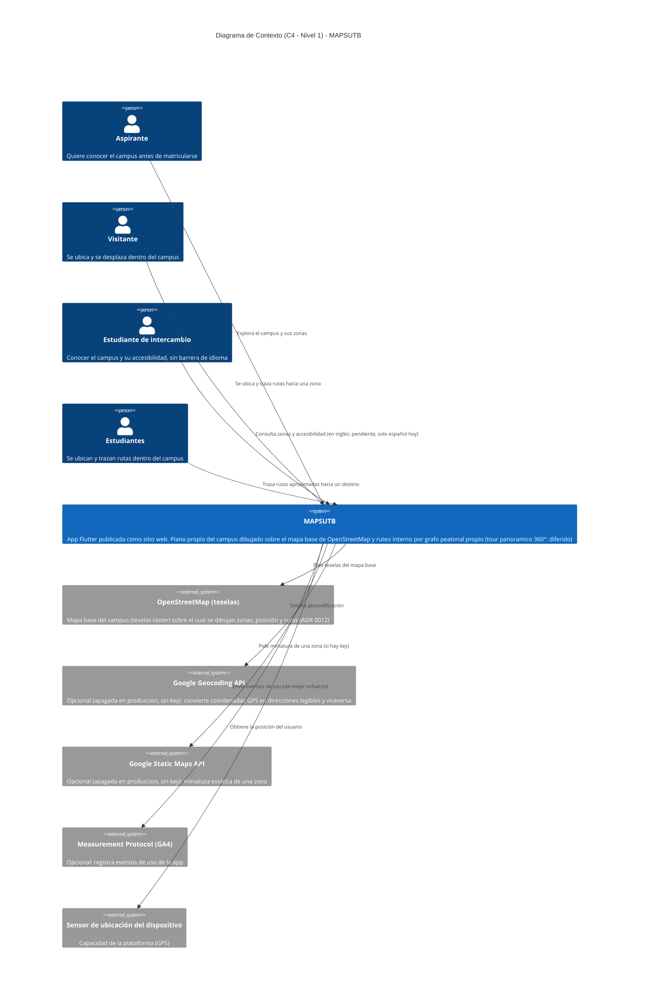

```mermaid
---
config:
  fontFamily: '''Inter Variable'', sans-serif'
---
C4Context
    title Diagrama de Contexto (C4 - Nivel 1) - MAPSUTB

    Person(aspirante, "Aspirante", "Quiere conocer el campus antes de matricularse")
    Person(invitado, "Visitante", "Se ubica y se desplaza dentro del campus")
    Person(intercambio, "Estudiante de intercambio", "Conocer el campus y su accesibilidad, sin barrera de idioma")
    Person(comunidad, "Estudiantes", "Se ubican y trazan rutas dentro del campus")

    System(mapsutb, "MAPSUTB", "App Flutter publicada como sitio web. Plano propio del campus dibujado sobre el mapa base de OpenStreetMap y ruteo interno por grafo peatonal propio (tour panoramico 360°: diferido)")

    System_Ext(osm, "OpenStreetMap (teselas)", "Mapa base del campus (teselas raster) sobre el cual se dibujan zonas, posición y rutas (ADR 0012)")
    System_Ext(geocoding, "Google Geocoding API", "Opcional (apagada en produccion, sin key): convierte coordenadas GPS en direcciones legibles y viceversa")
    System_Ext(staticmaps, "Google Static Maps API", "Opcional (apagada en produccion, sin key): miniatura estatica de una zona")
    System_Ext(analytics, "Measurement Protocol (GA4)", "Opcional: registra eventos de uso de la app")
    System_Ext(sensor, "Sensor de ubicación del dispositivo", "Capacidad de la plataforma (GPS)")

    Rel_L(aspirante, mapsutb, "Explora el campus y sus zonas")
    Rel(invitado, mapsutb, "Se ubica y traza rutas hacia una zona")
    Rel(intercambio, mapsutb, "Consulta zonas y accesibilidad (en inglés: pendiente, solo español hoy)")
    Rel(comunidad, mapsutb, "Traza rutas aproximadas hacia un destino")
    Rel_D(mapsutb, geocoding, "Solicita geocodificación")
    Rel_D(mapsutb, osm, "Pide teselas del mapa base")
    Rel_D(mapsutb, staticmaps, "Pide miniatura de una zona (si hay key)")
    Rel_D(mapsutb, analytics, "Envía eventos de uso (de mejor esfuerzo)")
    Rel_D(mapsutb, sensor, "Obtiene la posición del usuario")

    UpdateLayoutConfig($c4ShapeInRow="3", $c4BoundaryInRow="1")
```
