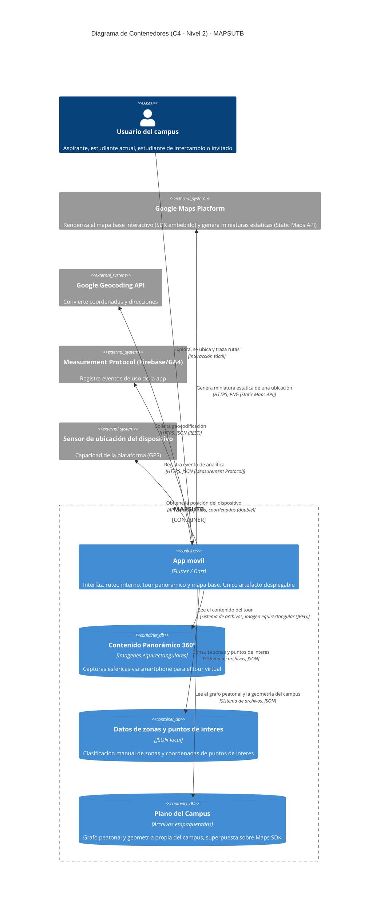

## Estado de implementación de los contenedores

| Contenedor | Estado | Evidencia / fecha objetivo |
|---|---|---|
| Datos de zonas y puntos de interés | Implementado (primera versión) | [`lib/repositories/zona_repository.dart`](../../lib/repositories/zona_repository.dart) |
| Plano del campus | Pendiente | Falta `MapaRepository`; fecha objetivo por definir por el equipo |
| Contenido panorámico 360° | Pendiente | Falta `TourRepository`; fecha objetivo por definir por el equipo |

Los dos contenedores marcados como pendientes están definidos en la decisión de diseño (Repository,
ver [ADR 0002](../adr/0002-patrones-de-diseno-sin-realidad-aumentada.md)) pero todavía no tienen
código ni activos reales detrás — se declaran así explícitamente en vez de dejarlo implícito en el
diagrama.

## Contrato de las integraciones HTTP

Las tres relaciones marcadas "HTTPS" en el diagrama (Static Maps API, Google Geocoding API y
Measurement Protocol) tienen contrato ejecutable versionado en
[`docs/api/apis-externas.openapi.yaml`](../api/apis-externas.openapi.yaml), implementación en
`lib/adapters/`, y prueba de contrato en `test/` (ver [ADR 0005](../adr/0005-integracion-apis-externas.md)).
La relación "SDK embebido (nativo)" con Google Maps Platform queda fuera de ese contrato: no es una
llamada REST que el código propio de MAPSUTB construya.
