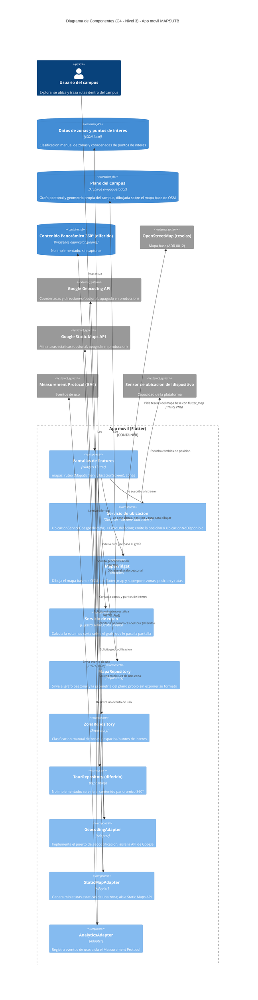

```mermaid
---
config:
  fontFamily: '''Inter Variable'', sans-serif'
---
C4Component
    title Diagrama de Componentes (C4 - Nivel 3) - App movil MAPSUTB

    Person(usuario, "Usuario del campus", "Explora, se ubica y traza rutas dentro del campus")

    Container_Boundary(app, "App movil (Flutter)") {
        Component(ui, "Pantallas de features", "Widgets Flutter", "mapas_ruteo (MapaScreen, UbicacionScreen), zonas")
        Component(ubicacion, "Servicio de ubicacion", "Observer - Stream<Ubicacion>", "UbicacionServiceGps (geolocator) + FiltroUbicacion; emite la posicion o UbicacionNoDisponible")
        Component(widget, "MapaWidget", "Adapter", "Dibuja el mapa base de OSM con flutter_map y superpone zonas, posicion y rutas")
        Component(ruteo, "Servicio de ruteo", "Dijkstra sobre grafo propio", "Calcula la ruta mas corta sobre el grafo que le pasa la pantalla")
        Component(mapaRepo, "MapaRepository", "Repository", "Sirve el grafo peatonal y la geometria del plano propio sin exponer su formato")
        Component(zonaRepo, "ZonaRepository", "Repository", "Clasificacion manual de zonas y espacios/puntos de interes")
        Component(tourRepo, "TourRepository (diferido)", "Repository", "No implementado: serviria el contenido panoramico 360°")
        Component(geocodingAdap, "GeocodingAdapter", "Adapter", "Implementa el puerto de geocodificacion; aisla la API de Google")
        Component(staticMapAdap, "StaticMapAdapter", "Adapter", "Genera miniaturas estaticas de una zona; aisla Static Maps API")
        Component(analyticsAdap, "AnalyticsAdapter", "Adapter", "Registra eventos de uso; aisla el Measurement Protocol")
    }

    ContainerDb(datos, "Datos de zonas y puntos de interes", "JSON local", "Clasificacion manual de zonas y coordenadas de puntos de interes")
    ContainerDb(plano, "Plano del Campus", "Archivos empaquetados", "Grafo peatonal y geometria propia del campus, dibujada sobre el mapa base de OSM")
    ContainerDb(assets, "Contenido Panorámico 360° (diferido)", "Imagenes equirectangulares", "No implementado: sin capturas")
    System_Ext(osm, "OpenStreetMap (teselas)", "Mapa base (ADR 0012)")
    System_Ext(geocoding, "Google Geocoding API", "Coordenadas y direcciones (opcional, apagada en produccion)")
    System_Ext(staticmaps, "Google Static Maps API", "Miniaturas estaticas (opcional, apagada en produccion)")
    System_Ext(analytics, "Measurement Protocol (GA4)", "Eventos de uso")
    System_Ext(sensor, "Sensor de ubicacion del dispositivo", "Capacidad de la plataforma")

    Rel(usuario, ui, "Interactua")

    Rel(ui, ubicacion, "Se suscribe al stream")
    Rel(ui, mapaRepo, "Obtiene el grafo peatonal")
    Rel(ui, ruteo, "Pide la ruta y le pasa el grafo")
    Rel(ui, zonaRepo, "Consulta zonas y puntos de interes")
    Rel(ui, widget, "Le pasa zonas, posicion y ruta para dibujar")
    Rel(ui, geocodingAdap, "Solicita geocodificacion")
    Rel(ui, staticMapAdap, "Solicita miniatura de una zona")
    Rel(ui, analyticsAdap, "Registra un evento de uso")
    Rel(ui, tourRepo, "Solicitaria panoramicas del tour (diferido)")

    Rel(ubicacion, sensor, "Escucha cambios de posicion")

    Rel(widget, osm, "Pide teselas del mapa base con flutter_map", "HTTPS, PNG")
    Rel(geocodingAdap, geocoding, "Solicita geocodificacion", "HTTPS")
    Rel(staticMapAdap, staticmaps, "Solicita miniatura estatica", "HTTPS, PNG")
    Rel(analyticsAdap, analytics, "Envia evento de uso", "HTTPS, JSON")

    Rel(mapaRepo, plano, "Lee")
    Rel(zonaRepo, datos, "Lee")
    Rel(tourRepo, assets, "Leeria (diferido)")

    UpdateLayoutConfig($c4ShapeInRow="3", $c4BoundaryInRow="1")
```
