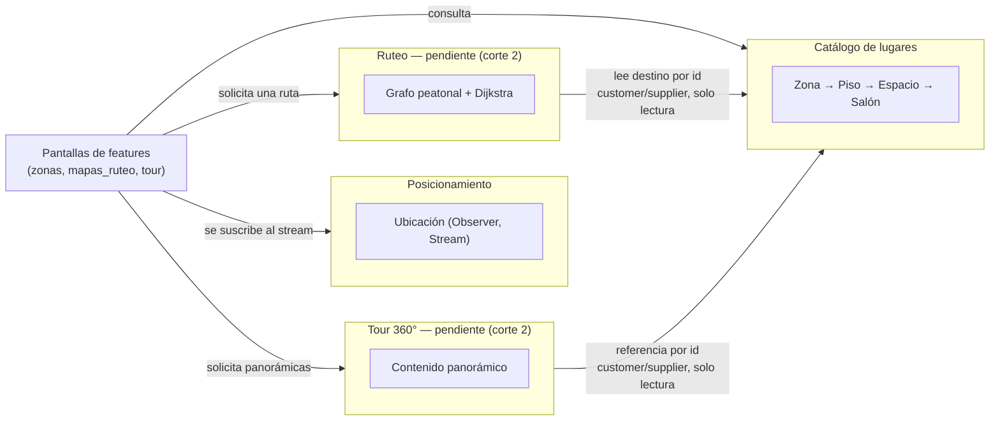

# Dominio y modularidad — Semana 6

Entrega incremental de la Semana 6 (Dominio y modularidad): mapa de contextos, tabla
módulo→datos con dueño único, y lista de no conformidades detectadas en el código actual
con su plan de corrección. Todo lo aquí descrito se verificó directamente contra el estado
real de `origin/master` (commit `a67cfc5`), no contra lo que la documentación *dice* que
existe.

## Mapa de contextos

MAPSUTB no tiene un dominio de negocio con varios equipos ni varios sistemas heredados —
es un cliente único Flutter. Aun así, el código ya distingue (y el corte 2 va a terminar
de separar) cuatro contextos con vocabulario y ciclo de vida propios:

- **Catálogo de lugares** — qué existe en el campus y cómo se organiza (`lib/models/zona.dart`,
  `piso.dart`, `espacio.dart`, `salon.dart`; expuesto por `ZonaRepository`,
  `lib/repositories/zona_repository.dart`). Es el contexto más maduro: ya implementado y
  con datos reales en `assets/data/zonas.json`.
- **Posicionamiento** — dónde está el usuario ahora mismo (`lib/models/ubicacion.dart`,
  `UbicacionService`, `lib/services/ubicacion_service.dart`). Hoy simulado con un timer;
  el ADR 0001/0002 ya dejó el patrón Observer listo para el reemplazo por GPS real.
- **Ruteo** — cómo llegar de un punto a otro (pendiente: `MapaRepository` + servicio de
  ruteo con Dijkstra, ya declarado como contenedor pendiente en `docs/c4/C2.md`).
- **Tour 360°** — contenido panorámico de un punto (pendiente: `TourRepository`, también
  declarado como pendiente en `docs/c4/C2.md`).

**Relación entre contextos:** Ruteo y Tour van a depender de Catálogo de lugares — pero
como *customer/supplier* de solo lectura (necesitan el id de una Zona/Espacio/Salón para
saber a qué punto corresponde una ruta o una foto), nunca como escritores de sus datos. No
existe hoy ninguna capa anticorrupción porque no hay ningún modelo externo (Google Maps
SDK, Geocoding) integrado todavía en el código — cuando se integren (fase 1 del corte 2),
`MapaWidget` y `GeocodingAdapter` (ya nombrados en el ADR 0001 y en `docs/c4/C2.md`) deben
cumplir ese papel: que ningún tipo de la librería de Google aparezca fuera de esos dos
adaptadores.

## Tabla módulo → datos (dueño único)

| Módulo | Dueño único de | Quién más lo toca |
|---|---|---|
| `ZonaRepository` (`lib/repositories/zona_repository.dart`) | `Zona`, `Piso`, `Espacio`, `Salon` — cargados desde `assets/data/zonas.json` | `ZonasScreen`, `ZonaDetalleScreen` (solo lectura); en el corte 2, Ruteo y Tour lo consultarán por id, también solo lectura |
| `UbicacionService` (`lib/services/ubicacion_service.dart`) | `Ubicacion` (posición en tiempo real, en memoria vía `Stream`, nunca persistida) | `UbicacionScreen`; en el corte 2, el servicio de ruteo y `MapaWidget` se suscribirán al mismo stream |
| `MapaRepository` — **pendiente** | Grafo peatonal (nodos/aristas) y las rutas que calcule Dijkstra sobre él | Servicio de ruteo y la UI de `mapas_ruteo` |
| `TourRepository` — **pendiente** | Contenido panorámico 360° (imagen + id de referencia a un `Espacio`/`Salon`) | Pantalla de tour |

Hoy no hay ninguna violación de este tipo en el código: cada modelo tiene exactamente un
repositorio/servicio que lo carga, y ninguno escribe sobre el archivo de otro. El riesgo
real está en lo que *todavía no se ha construido* — ver no conformidad #3 abajo.

## No conformidades detectadas y plan de corrección

### 1. "Zona" significa dos cosas distintas según el documento que se lea (alta)

El glosario define **Zona** como *"clasificación manual de un espacio del campus (por
ejemplo, salón, laboratorio u oficina)"* (`docs/arc42/12_glossary.adoc:57`). Pero en el
código, `Zona` (`lib/models/zona.dart`) es el nivel **superior** de la jerarquía —
`tipo` acepta `'edificio'`, `'cafeteria'`, `'parqueadero'`, `'zona_comun'` — y contiene una
lista de `Espacio` (`lib/models/espacio.dart`), que es la clase cuyo campo `tipo` sí acepta
`'salon'`, `'laboratorio'`, `'oficina'`. Es decir: lo que el glosario describe como "Zona"
es, en el código, la clase `Espacio`.

**Plan de corrección:** reescribir la entrada de "Zona" en el glosario para que describa el
nivel real (edificio/cafetería/parqueadero/zona común, con `pisos` y `espacios` opcionales),
y agregar una entrada propia para "Espacio" que hoy no existe en el glosario.

### 2. "Punto de interés" es un término sin clase propia (alta)

"Punto de interés" aparece en al menos ocho documentos (`ficha_problema.md`, `aspectos.md`,
`escenarios_calidad.md`, y cinco archivos de `docs/arc42/`) y hasta en el propio diagrama
C4 de componentes, donde el repositorio se nombra literalmente
`ZonaRepository / PuntoInteresRepository` (`docs/arc42/05_building_block_view.md:183`). Sin
embargo no existe ninguna clase `PuntoDeInteres` ni `PuntoInteresRepository` en `lib/models/`
ni en `lib/repositories/` — solo `Zona`, `Piso`, `Espacio` y `Salon`. El propio glosario lo
define como *"ubicación específica dentro de una zona, con coordenadas propias"*
(`docs/arc42/12_glossary.adoc`), pero ni `Espacio` ni `Salon` tienen campo de coordenadas
en el código — solo `Zona` los tiene. Y el uso en la práctica es inconsistente: en
`aspectos.md` el ejemplo de destino es *"ZONA T"*, es decir, un `Zona` completo, no un
espacio dentro de él.

**Plan de corrección:** el equipo debe decidir una sola vez a qué nivel de la jerarquía
corresponde "punto de interés" (el candidato más natural es `Espacio`/`Salon`, que es el
destino navegable concreto) y luego: (a) actualizar el glosario con esa definición única,
(b) renombrar el componente en el diagrama C4 a su nombre real, `ZonaRepository` — sin la
barra ni la clase fantasma —, y (c) revisar los ocho documentos listados arriba para que
usen el término en ese único sentido.

### 3. Riesgo de escritura compartida ya planeado para el corte 2 (media)

En la bitácora de construcción ya circulada se propuso que `TourRepository` extienda
`Espacio` (o `Salon`) agregándole la referencia a su foto 360°. Eso haría que dos
repositorios (`ZonaRepository` y `TourRepository`) escriban sobre el mismo árbol de
modelos — exactamente la antipatrón de "dos escritores sobre el mismo dato" que esta
semana pide detectar, solo que todavía no se ha escrito el código.

**Plan de corrección:** `TourRepository` debe tener su propio archivo de datos (por
ejemplo `assets/data/tour.json`), indexado por el `id` de `Espacio` o `Salon`, y nunca
modificar las clases de `lib/models/zona.dart` y afines. `ZonaRepository` sigue siendo el
único escritor de esa jerarquía; `TourRepository` la consulta solo por id.

### 4. Documento de arquitectura duplicado dentro del código fuente (baja)

`lib/models/05_building_block_view.md` es una copia — con formato ligeramente distinto
pero el mismo contenido — de `docs/arc42/05_building_block_view.md`. Vive dentro del árbol
de fuentes Dart (`lib/models/`), junto a `zona.dart`, `piso.dart`, etc., lo cual no tiene
relación con su contenido y puede confundir a cualquiera que explore ese paquete.

**Plan de corrección:** `git rm lib/models/05_building_block_view.md` — la versión
canónica ya vive en `docs/arc42/`.

## Referencias

- [`docs/c4/C2.md`](./c4/C2.md) — declara `MapaRepository` y `TourRepository` como
  contenedores pendientes.
- [`docs/arc42/05_building_block_view.md`](./arc42/05_building_block_view.md) — diagrama
  C4 de componentes referenciado en las no conformidades #2 y #4.
- [`docs/arc42/12_glossary.adoc`](./arc42/12_glossary.adoc) — glosario referenciado en las
  no conformidades #1 y #2.
- [`docs/adr/0001-patrones-de-diseno.md`](./adr/0001-patrones-de-diseno.md) — Repository,
  Adapter y Observer ya adoptados; base de los contextos descritos arriba.
