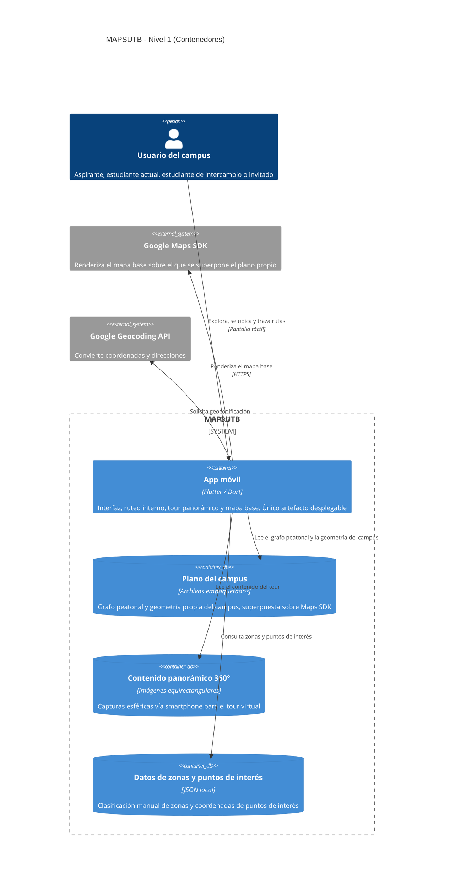
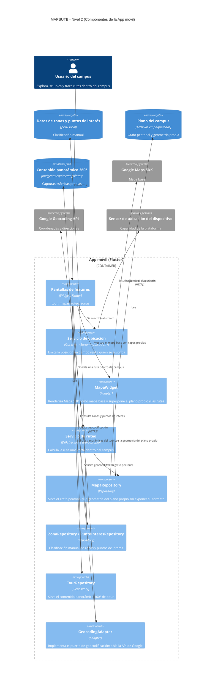

# Vista de Bloques

## Sistema General de Caja Blanca

**Motivación**

MAPSUTB se separa en un único artefacto desplegable (la app móvil Flutter) y tres almacenes de datos empaquetados localmente (plano del campus, contenido panorámico y datos de zonas/puntos de interés). No existe backend propio: toda la información vive dentro del paquete de la app o se resuelve consultando directamente los servicios de Google (Maps SDK y Geocoding API), lo que reduce la infraestructura a cargo del equipo pero introduce una dependencia fuerte de la disponibilidad de estos servicios externos (ver decisiones de diseño y restricciones técnicas).

**Bloques de construcción contenidos**

| **Nombre** | **Responsabilidad** |
|---|---|
| App móvil | Único artefacto desplegable. Contiene toda la lógica de interfaz, ubicación, ruteo interno, mapa base y tour panorámico. |
| Plano del campus | Empaqueta el grafo peatonal y la geometría propia del campus, usados para el ruteo interno y para superponerse sobre Maps SDK. |
| Contenido panorámico 360° | Empaqueta las imágenes equirectangulares capturadas vía smartphone para el módulo de tour virtual. |
| Datos de zonas y puntos de interés | Empaqueta el JSON con la clasificación manual de zonas (salones, laboratorios, oficinas) y sus coordenadas. |

**Interfases importantes**

- **Google Maps SDK** (HTTPS): usada por la App móvil para renderizar el mapa base sobre el cual se dibuja el plano propio del campus.
- **Google Geocoding API** (HTTPS): usada por la App móvil para convertir coordenadas GPS en direcciones legibles y viceversa.

### App móvil

*Propósito/Responsabilidad*

Único artefacto desplegable del sistema. Provee la interfaz de usuario (pantallas de tour, mapas/ruteo y zonas), gestiona la ubicación en tiempo real del usuario, calcula rutas dentro del campus sobre el grafo peatonal propio, renderiza el mapa base (Maps SDK) con el plano propio superpuesto, y muestra el tour panorámico 360°.

*Interfase(s)*

- Consume el sensor de ubicación del dispositivo.
- Consume Google Maps SDK (HTTPS) para el mapa base.
- Consume Google Geocoding API (HTTPS) para geocodificación.
- Lee los tres contenedores de datos empaquetados localmente (plano, panoramas, datos de zonas).

*(Opcional) Características de Calidad/Performance*

Requiere conexión a internet permanente; no funciona offline. No está restringida a la red wifi institucional ni al perímetro del campus.

*(Opcional) Ubicación Archivo/Directorio*

Repositorio: `github.com/ISCOUTB/AS_202620_mapsutb`

*(Opcional) Requerimientos Satisfechos*

Geolocalización en tiempo real, trazado de rutas dentro del campus, clasificación de zonas, tour panorámico, interfaz en inglés para estudiantes de intercambio.

*(Opcional) Riesgos/Problemas/Incidentes Abiertos*

Aún no se ha definido el motor/librería para mostrar panorámicas 360° en Flutter. La navegación en interiores queda fuera del alcance inicial.

### Plano del campus

*Propósito/Responsabilidad*

Almacena, empaquetado dentro de la app, el grafo peatonal (nodos y conexiones entre entradas, plazoletas y bloques) y la geometría propia del campus, usados para el ruteo interno y para superponerse visualmente sobre el mapa base de Maps SDK.

*Interfase(s)*

Expuesto a la App móvil a través de un repositorio (`MapaRepository`) que oculta el formato interno del archivo.

*(Opcional) Riesgos/Problemas/Incidentes Abiertos*

El levantamiento del grafo peatonal es manual y depende de que el equipo lo mantenga actualizado ante cambios físicos del campus.

### Contenido panorámico 360°

*Propósito/Responsabilidad*

Almacena las imágenes equirectangulares (capturas esféricas vía smartphone, tipo Google Street View App) usadas por el módulo de tour virtual.

*Interfase(s)*

Expuesto a la App móvil a través de un repositorio (`TourRepository`).

*(Opcional) Riesgos/Problemas/Incidentes Abiertos*

El equipo no cuenta con cámaras 360° dedicadas; la calidad de la captura depende del smartphone usado. Aún no se ha definido el motor/librería de renderizado 360° en Flutter.

### Datos de zonas y puntos de interés

*Propósito/Responsabilidad*

Almacena la clasificación manual de zonas del campus (salones, laboratorios, oficinas, etc.) y las coordenadas de sus puntos de interés.

*Interfase(s)*

Expuesto a la App móvil a través de un repositorio (`ZonaRepository` / `PuntoInteresRepository`).

*(Opcional) Riesgos/Problemas/Incidentes Abiertos*

La clasificación es cargada manualmente por el equipo; no se actualiza dinámicamente ni la mantiene la universidad.

### Google Maps SDK

*Propósito/Responsabilidad*

Servicio externo de Google que renderiza el mapa base (con coordenadas GPS reales) sobre el cual la App móvil superpone el plano propio del campus.

*Interfase(s)*

HTTPS / SDK nativo de Google Maps.

*(Opcional) Riesgos/Problemas/Incidentes Abiertos*

Dependencia fuerte de la disponibilidad del servicio de Google; sujeto a límites de cuota/costo según uso.

### Google Geocoding API

*Propósito/Responsabilidad*

Servicio externo de Google que convierte coordenadas GPS en direcciones legibles y viceversa.

*Interfase(s)*

HTTPS / REST.

*(Opcional) Riesgos/Problemas/Incidentes Abiertos*

Dependencia fuerte de la disponibilidad del servicio de Google; sujeto a límites de cuota/costo según uso.

## Nivel 2

### Caja Blanca App móvil

Se detalla la App móvil por ser el único artefacto desplegable del sistema y el que concentra toda la lógica de negocio. Los demás bloques del Nivel 1 (plano del campus, contenido panorámico, datos de zonas) son simples almacenes de datos empaquetados sin lógica propia, por lo que no se detallan en un nivel adicional.

- **Pantallas de features** (Widgets Flutter): agrupa las pantallas de tour, mapas/ruteo y zonas; es el único punto de entrada de la interacción del usuario.
- **Servicio de ubicación** (patrón Observer, `Stream<Ubicacion>`): escucha el sensor de ubicación del dispositivo y emite la posición en tiempo real a quien se suscriba.
- **MapaWidget** (patrón Adapter): renderiza Google Maps SDK como mapa base y superpone sobre él el plano propio del campus y las rutas calculadas.
- **Servicio de ruteo** (Dijkstra sobre grafo propio): calcula la ruta más corta dentro del campus a partir del grafo peatonal; no depende de ningún servicio externo.
- **MapaRepository** (patrón Repository): sirve el grafo peatonal y la geometría del plano propio sin exponer su formato de archivo.
- **ZonaRepository / PuntoInteresRepository** (patrón Repository): sirve la clasificación manual de zonas y puntos de interés desde el JSON local.
- **TourRepository** (patrón Repository): sirve el contenido panorámico 360° al módulo de tour.
- **GeocodingAdapter** (patrón Adapter): implementa el puerto de geocodificación y aísla al resto de la app del SDK de Google Geocoding.

## Nivel 3

No se documenta un Nivel 3. Los componentes descritos en el Nivel 2 (pantallas, servicios, repositorios y adaptadores) son lo suficientemente simples y de bajo riesgo como para no justificar una descomposición interna adicional; su implementación se resuelve a nivel de clases dentro de cada componente sin complejidad arquitectónica relevante.
